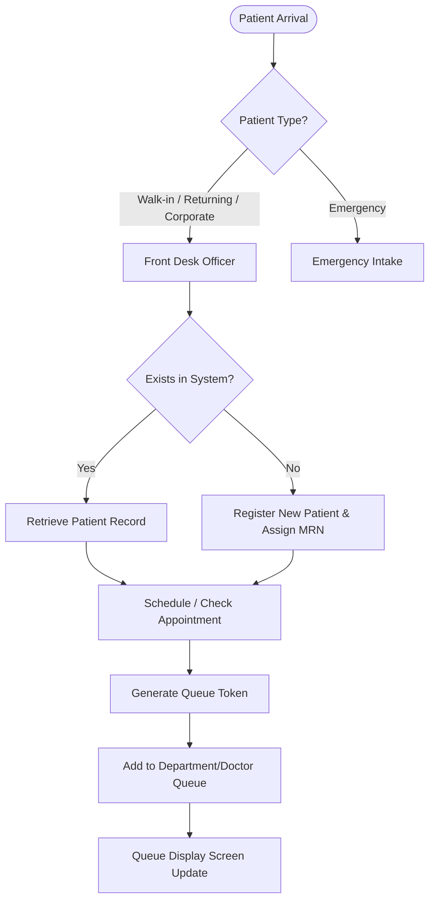
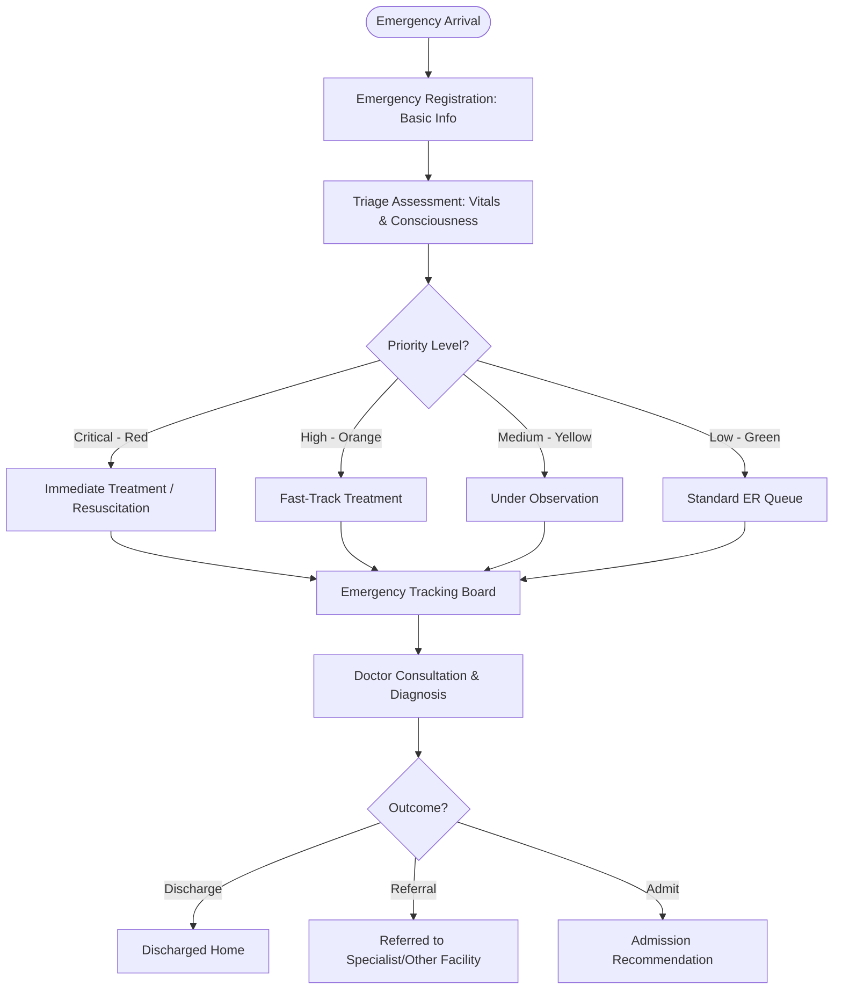
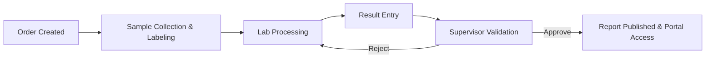

# Functional Requirements Specification (FRS), Software Requirements Specification (SRS) & User Stories

This document defines the functional requirements, system constraints, and user stories for **Phase 1** of the **Healthcare Intelligence Platform (HIP)**.

---

## 1. Functional Requirements Specification (FRS)

### 1.1 Module 1: Front Desk Operations

The Front Desk module serves as the primary gateway for patients entering the facility (except direct emergency cases). It manages patient registration, appointment scheduling, and patient flow.



#### 1.1.1 Patient Registration
* **Walk-in & Returning Patients:** The system must allow Front Desk Officers to register new walk-in patients or retrieve existing patient records.
* **Corporate Patients:** Allow association with a corporate partner/billing account (for eligibility validation, though billing execution is deferred).
* **Emergency Migration:** Allow front-desk registration verification for patients admitted through the Emergency workflow.
* **Data Capture Requirements:** The registration form must capture the following fields:
  * **MRN (Medical Record Number):** Auto-generated, unique, format `MRN-YYYY-XXXXX`.
  * **Full Name:** Required, text.
  * **CNIC / National ID:** Required for citizens, formatted pattern matching.
  * **Passport Number:** Required for foreign nationals if CNIC is unavailable.
  * **Gender:** Dropdown (Male, Female, Other, Prefer not to say).
  * **Date of Birth (DOB):** Required, date selector (auto-calculates age).
  * **Contact Information:** Phone number (validated), email (optional).
  * **Address:** Street address, city, state, postal code.
  * **Blood Group:** Dropdown (A+, A-, B+, B-, AB+, AB-, O+, O-, Unknown).
  * **Emergency Contact:** Name, relationship, and contact number.
  * **Patient Photograph:** Support uploading a JPG/PNG profile photo.
  * **Consent Acceptance:** Digital checkbox certifying consent for data treatment and privacy policies (mandatory to save).

#### 1.1.2 Appointment Management
* **Scheduling:** Front Desk Officers can schedule appointments by selecting a patient, department, doctor, date, and available time slot.
* **Doctor Assignment:** View doctor availability schedules and assign patients accordingly.
* **Rescheduling & Cancellation:** Allow modifying the date/time of scheduled appointments or cancelling them. Must log reasons for cancellations.
* **Arrival Tracking:** Mark patient status as "Checked-in" upon arrival, which triggers queue placement.
* **Waiting List:** If a doctor's schedule is full, allow adding the patient to a priority waiting list.

#### 1.1.3 Queue Management
* **Token Generation:** Upon check-in, generate a unique queue token (e.g., `FD-PEDS-014` or `FD-DR-SMITH-005`).
* **Queue Tracking:** Real-time tracking of queue status (Waiting, Serving, Completed, No-Show).
* **Department & Doctor Queues:** Separate queues segmented by department (e.g., Pediatrics, General Medicine) and by individual doctor.
* **Queue Display Screens:** Read-only dashboard view displaying active token numbers per department/room for patient viewing.
* **Notification Readiness:** Expose webhooks and webhook payloads designed to plug into SMS/WhatsApp gateways for status alerts.

#### 1.1.4 Search & Retrieval
* **Universal Search Bar:** Optimized index search using:
  * Medical Record Number (MRN)
  * CNIC / National ID / Passport
  * Mobile Number
  * Patient Name (partial/fuzzy matching)

---

### 1.2 Module 2: Emergency Management

The Emergency Management module coordinates fast-track registration, triage classification, and real-time patient tracking.



#### 1.2.1 Emergency Registration
* **Rapid Intake:** Allow registration with minimal information to avoid delaying critical care:
  * Temporary Name (e.g., "Unknown Male 01" if unconscious).
  * Arrival Time (auto-populated timestamp).
  * Mode of Arrival (Self, Ambulance, Police, Bystander).
  * Ambulance Information (Service provider, vehicle number, if applicable).
  * Emergency Contact details (if available).
  * Initial Condition (Brief description of symptoms/trauma).

#### 1.2.2 Triage Management
* **Triage Priority Levels:** Implement internationally recognized triage systems (e.g., Emergency Severity Index / Manchester Triage System):
  * **Critical (Red):** Immediate life-saving intervention needed.
  * **High (Orange):** Emergent, high-risk situation, rapid response.
  * **Medium (Yellow):** Urgent, stable vitals but requires timely evaluation.
  * **Low (Green):** Non-urgent, stable.
* **Vitals & Consciousness Capture:**
  * Blood Pressure (Systolic / Diastolic in mmHg)
  * Pulse Rate (BPM)
  * Temperature (°C / °F)
  * Oxygen Saturation (SpO2 %)
  * Respiratory Rate (breaths per minute)
  * Consciousness Level: AVPU scale (Alert, Voice, Pain, Unresponsive) or Glasgow Coma Scale (GCS).

#### 1.2.3 Emergency Tracking
* **Live Patient Status Board:** Real-time dashboard depicting patient location and current stage:
  * *Waiting for Triage*
  * *Triage Completed (Waiting for Doctor)*
  * *Under Treatment*
  * *Under Observation*
  * *Discharged*
  * *Referred*
  * *Admitted (Recommendation Raised)*

#### 1.2.4 Emergency Dashboard
* **Real-Time KPIs:**
  * Total Emergency Patients currently active.
  * Number of Critical Cases.
  * Average Response Time (minutes from arrival to triage).
  * Average Treatment Time (minutes from triage to discharge/disposition).
  * Doctor & Nurse Workload (number of active cases assigned per provider).

---

### 1.3 Module 3: Laboratory Management

The Laboratory Information Management System (LIMS) manages the lifecycles of lab orders, specimen collection, result entry, and verification.



#### 1.3.1 Laboratory Orders
* **Order Creation:** Ability to create test orders for registered patients.
* **Test Grouping / Panels:** Allow grouping of tests into standard panels (e.g., Complete Blood Count (CBC), Liver Function Test (LFT), Basic Metabolic Panel (BMP)).
* **Sample Tracking:** Unique sample tracking numbers generated for each order.

#### 1.3.2 Sample Collection
* **Sample Registration:** Capture details at the time of specimen collection:
  * Sample Number (Unique barcode ID, auto-generated).
  * Collection Time (timestamp).
  * Collector Name (Logged user).
  * Sample Type (Whole Blood, Serum, Plasma, Urine, CSF, Swab, Tissue).

#### 1.3.3 Laboratory Processing
* **Department-wise Processing:** Categorization of orders into lab departments:
  * **Hematology** (e.g., CBC, ESR, Coagulation)
  * **Biochemistry** (e.g., LFT, RFT, Lipid Profile, Blood Glucose)
  * **Microbiology** (e.g., Cultures, Gram Staining)
  * **Serology** (e.g., Widal, Rheumatoid Factor, Viral Markers)
  * **Pathology** (e.g., Biopsy, Cytology)
* **Status Updates:** Order status transitions: Ordered -> Sample Collected -> In Laboratory -> Processing -> Completed -> Verified.

#### 1.3.4 Result Entry
* **Manual Input Form:** Structured forms with reference ranges matching patient age and gender.
* **Validation Workflow:** Lab Technicians enter values; system highlights out-of-range/critical values.
* **Approval Workflow:** Lab Supervisors review entered values, check against quality metrics, and approve or reject (send back for re-testing).
* **Audit Logging:** Any changes to results after entry must log the previous value, new value, modifier identity, timestamp, and reason.

#### 1.3.5 Report Publishing
* **PDF Report Generation:** Generate official laboratory reports containing patient data, MRN, sample metadata, test results, reference ranges, critical flags, and electronic signatures of the performing technician and approving supervisor.
* **Secure Portal & Doctor Access:** Make approved PDF reports immediately accessible on the patient dashboard and doctor clinical view.
* **Email Distribution Readiness:** Event-driven hooks to queue emails with secure PDF attachments (passcode protected).

#### 1.3.6 Laboratory Dashboard
* **Operational Metrics:**
  * Pending Samples (collected but not processed).
  * Completed Tests (within the last 24 hours).
  * Rejected Samples (reason-logged list, e.g., hemolyzed sample).
  * Average Processing Time (Turnaround Time - TAT).
  * Lab Workload (active tests per technician).

---

### 1.4 Module 4: Reporting & Analytics

Executive and operational dashboards aggregating platform metrics to enable data-driven hospital administration.

#### 1.4.1 Executive Dashboard
* **High-Level KPIs:**
  * **Total Patients:** Lifetime registered.
  * **Daily Registrations:** Active registrations today vs. historical average.
  * **Emergency Visits:** Total emergency intakes today, split by triage level.
  * **Laboratory Tests:** Total tests ordered and completed today.
  * **Average Waiting Time:** Mean time spent by patients in queues.
  * **Average Emergency Response Time:** Mean time from arrival to first triage assessment.
  * **Top Laboratory Tests:** Most ordered tests represented in bar charts.
  * **Patient Growth Trends:** Monthly registrations line chart.

#### 1.4.2 Operational Dashboard
* **Front Desk Performance:** Average registration duration, check-in rate, no-show rate.
* **Emergency Performance:** Average time to discharge/admission, critical case survival rates, doctor workload distribution.
* **Laboratory Performance:** Turnaround Time (TAT) per test panel, sample rejection rates.

#### 1.4.3 Reporting Features
* **Export Formats:** Full support for exporting reports to **PDF**, **Excel (XLSX)**, and **CSV**.
* **Scheduled Reports:** Enable Hospital Administrators to configure daily, weekly, or monthly automatic email reports.
* **Role-Based Reporting:** Hide sensitive patient personal data (PII) on operational dashboards unless accessed by authorized roles.

#### 1.4.4 Visualizations
* **KPI Cards:** Display numbers with percentage changes (color-coded red/green for performance trends).
* **Trend Charts:** Line and area charts for volume monitoring.
* **Department Comparison:** Grouped column charts showing comparative patient load.
* **Heat Maps:** Patient load by hour of day and day of week to optimize staffing.

---

## 2. Software Requirements Specification (SRS)

### 2.1 Scope & Constraints
* **Scope:** Phase 1 delivers Front Desk, Emergency, Laboratory, and Analytics dashboards.
* **Future Expansion Constraints:** The database structure, API design, and authorization layer must support future modules (Billing, EMR, Pharmacy, Radiology) without breaking schemas. Tables like `patients` must serve as the single source of truth, linked via foreign keys.
* **Regulatory Compliance:** Designed around HIPAA guidelines (data minimization, authorization checks, comprehensive audit logs).

### 2.2 Non-Functional Requirements (NFRs)

#### 2.2.1 Performance
* **Response Time:** Frontend-to-backend REST API response times must be < 200ms for 95% of standard CRUD operations under normal load.
* **Search Latency:** Patient lookup by MRN/CNIC must take < 500ms using indexed columns.
* **Dashboard Load:** Complex analytical aggregations must load in < 2 seconds, utilizing materialized views or background aggregations if necessary.

#### 2.2.2 Scalability & Availability
* **High Availability:** Architecture must support 99.9% uptime (excluding planned maintenance).
* **Horizontal Scaling:** API instances must be stateless, permitting container scaling via Docker.
* **Concurrency:** Design database connection pools to support at least 150 concurrent active write connections and 1,000 read connections.

#### 2.2.3 Compatibility & Responsiveness
* **Devices:** 100% functional on desktops (minimum resolution 1280x720), tablets (iPad, Android tablets), and mobile viewports.
* **Browsers:** Compatible with all modern evergreen browsers (Chrome, Edge, Safari, Firefox).

---

## 3. User Stories & Acceptance Criteria

### 3.1 Super Administrator
#### US-01: User Management & RBAC configuration
* **As a** Super Administrator,
* **I want to** create user accounts and assign specific roles,
* **So that** only authorized hospital personnel can access their respective modules.
* **Acceptance Criteria:**
  ```gherkin
  Given the Super Administrator is logged into the management panel
  When they create a new user profile with email "nurse1@hospital.com" and select the role "Emergency Nurse"
  Then the user profile is successfully saved in the database
  And the user is assigned the predefined permissions for emergency nurses
  And an activity log is created documenting the user registration
  ```

---

### 3.2 Front Desk Officer
#### US-02: Patient Registration with Consent
* **As a** Front Desk Officer,
* **I want to** register a new walk-in patient and capture their demographic details and consent,
* **So that** they are admitted into the hospital system and assigned a unique MRN.
* **Acceptance Criteria:**
  ```gherkin
  Given the Front Desk Officer is on the Patient Registration page
  When they enter valid details (Name: John Doe, DOB: 1990-05-15, CNIC: 12345-6789012-3, Blood Group: O+)
  And check the "Consent Accepted" checkbox
  And click "Save"
  Then a new record is created in the database
  And a unique MRN formatting as "MRN-2026-XXXXX" is generated and returned
  And a "Registration Successful" toast notification is displayed
  ```

#### US-03: Queue Token Generation
* **As a** Front Desk Officer,
* **I want to** check in a patient and generate a queue token,
* **So that** they are placed in the appropriate department/doctor queue.
* **Acceptance Criteria:**
  ```gherkin
  Given the Front Desk Officer has retrieved a patient record
  When they click on "Check-in to Department" and select "General Medicine" and "Dr. Sarah Smith"
  Then the patient's queue status changes to "Waiting"
  And a token containing the pattern "GM-DRSMITH-XX" is generated
  And the department queue display board automatically refreshes to list this token
  ```

---

### 3.3 Emergency Reception Officer
#### US-04: Quick Emergency Intake
* **As an** Emergency Reception Officer,
* **I want to** quickly register an emergency patient with minimal details,
* **So that** medical personnel can immediately begin triage without clinical delays.
* **Acceptance Criteria:**
  ```gherkin
  Given the Emergency Reception Officer is on the Emergency Intake screen
  When they select Mode of Arrival: "Ambulance"
  And input Initial Condition: "Severe chest pain, semi-conscious"
  And save the record
  Then the system generates a temporary profile with a unique emergency sequence ID
  And sets the status to "Waiting for Triage"
  And immediately places the patient on the Emergency Nurse Triage board
  ```

---

### 3.4 Emergency Nurse
#### US-05: Triage and Vitals Entry
* **As an** Emergency Nurse,
* **I want to** record a patient's vitals and select a triage category,
* **So that** doctors are immediately aware of the patient's priority level.
* **Acceptance Criteria:**
  ```gherkin
  Given the Emergency Nurse selects an emergency patient from the "Waiting for Triage" board
  When they enter Blood Pressure "140/90", Pulse "95", Oxygen Saturation "94%", Consciousness "Alert"
  And select Priority Level "High (Orange)"
  And click "Submit Triage"
  Then the patient's status changes to "Triage Completed (Waiting for Doctor)"
  And they are repositioned on the Emergency Doctor's queue sorted by priority (Critical first)
  And a critical alert is triggered if vitals meet predefined danger thresholds
  ```

---

### 3.5 Emergency Doctor
#### US-06: Diagnosis and Disposition
* **As an** Emergency Doctor,
* **I want to** record the consultation details, diagnosis, and final disposition (discharge/admit/refer),
* **So that** the emergency workflow is concluded for that patient.
* **Acceptance Criteria:**
  ```gherkin
  Given the Emergency Doctor is viewing a patient marked "Under Treatment"
  When they enter the primary diagnosis "Acute Coronary Syndrome"
  And select Disposition: "Admission Recommendation"
  And submit the clinical note
  Then the patient's status updates to "Admitted (Recommendation Raised)"
  And the patient is removed from the active emergency workload board
  And an entry is logged in the audit trail
  ```

---

### 3.6 Laboratory Technician
#### US-07: Sample Collection Logging
* **As a** Laboratory Technician,
* **I want to** update the status of a test order to "Sample Collected" and log the specimen details,
* **So that** the laboratory tracking flow is maintained.
* **Acceptance Criteria:**
  ```gherkin
  Given the Laboratory Technician is viewing a pending lab order
  When they scan or input Sample Number "SMP-998877"
  And select Sample Type "Whole Blood"
  And click "Mark Collected"
  Then the order status updates to "Sample Collected"
  And the collection time is logged with the current timestamp
  And the collector field is populated with the technician's user ID
  ```

#### US-08: Lab Result Entry
* **As a** Laboratory Technician,
* **I want to** manually enter the test results for processing,
* **So that** they can be forwarded to the supervisor for quality validation.
* **Acceptance Criteria:**
  ```gherkin
  Given the Laboratory Technician is viewing a sample in the "Processing" stage
  When they input a Hemoglobin value of "14.2 g/dL" (within range) and WBC of "11,500 /uL" (flagged high)
  And click "Submit for Validation"
  Then the status transitions to "Pending Validation"
  And the record is added to the Laboratory Supervisor's approval workspace
  ```

---

### 3.7 Laboratory Supervisor
#### US-09: Laboratory Result Verification and Approval
* **As a** Laboratory Supervisor,
* **I want to** review and validate pending test results,
* **So that** I can approve and publish the official diagnostic report or reject it for re-testing.
* **Acceptance Criteria:**
  ```gherkin
  Given the Laboratory Supervisor is viewing the validation dashboard
  When they review the results for Patient "John Doe" (Hemoglobin: 14.2, WBC: 11,500)
  And click "Approve and Sign"
  Then the test status changes to "Completed"
  And the system automatically renders the signed PDF report
  And makes the PDF report visible on the Patient and Doctor portals
  ```

---

### 3.8 Reporting Manager
#### US-10: Exporting Dashboard Metrics
* **As a** Reporting Manager,
* **I want to** filter operational and executive dashboards and export the data,
* **So that** I can share reporting insights with hospital executives.
* **Acceptance Criteria:**
  ```gherkin
  Given the Reporting Manager is on the Operational Analytics page
  When they select Date Range "Last 30 Days"
  And select Department "Emergency"
  And click "Export as PDF"
  Then the system generates a formatted PDF containing KPI cards, charts, and summary tables
  And initiates a secure download to the manager's device
  ```
