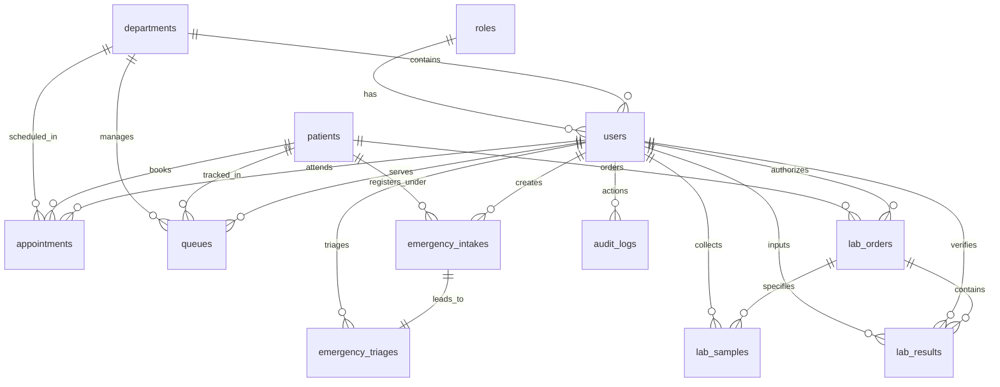

# Database Schema, ERD Diagram & API Specifications

This document defines the relational database architecture and REST API design for the Healthcare Intelligence Platform (HIP).

---

## 1. Database Schema (PostgreSQL)

To maintain patient data integrity, enforce RBAC, and accommodate future modules, the database uses strong typing, foreign keys, unique indexing, and automated audit triggers.

```sql
-- Enable UUID extension
CREATE EXTENSION IF NOT EXISTS "uuid-ossp";

-- 1. Roles Table
CREATE TABLE roles (
    id SERIAL PRIMARY KEY,
    name VARCHAR(50) UNIQUE NOT NULL,
    description VARCHAR(255),
    created_at TIMESTAMP WITH TIME ZONE DEFAULT CURRENT_TIMESTAMP
);

-- Insert Roles
INSERT INTO roles (name, description) VALUES
('Super Administrator', 'Full platform control, hospital configuration, and user management'),
('Hospital Administrator', 'Operational management, reporting access, and department config'),
('Front Desk Officer', 'Patient registration, appointment, and queue management'),
('Emergency Reception Officer', 'Emergency intake and basic triage initiation'),
('Emergency Nurse', 'Patient vitals assessment and triage priority logging'),
('Emergency Doctor', 'Emergency consultations and clinical diagnoses'),
('Laboratory Technician', 'Specimen collection, processing, and raw result logging'),
('Laboratory Supervisor', 'Quality validation and clinical result approvals'),
('Reporting Manager', 'Operational analytics and dashboard access');

-- 2. Departments Table
CREATE TABLE departments (
    id SERIAL PRIMARY KEY,
    name VARCHAR(100) NOT NULL,
    code VARCHAR(10) UNIQUE NOT NULL,
    is_active BOOLEAN DEFAULT TRUE,
    created_at TIMESTAMP WITH TIME ZONE DEFAULT CURRENT_TIMESTAMP
);

-- 3. Users Table (Staff Profiles)
CREATE TABLE users (
    id UUID PRIMARY KEY DEFAULT uuid_generate_v4(),
    email VARCHAR(100) UNIQUE NOT NULL,
    password_hash VARCHAR(255) NOT NULL,
    role_id INTEGER REFERENCES roles(id) ON DELETE RESTRICT,
    department_id INTEGER REFERENCES departments(id) ON DELETE SET NULL,
    full_name VARCHAR(100) NOT NULL,
    phone VARCHAR(20),
    is_active BOOLEAN DEFAULT TRUE,
    mfa_secret VARCHAR(100),
    mfa_enabled BOOLEAN DEFAULT FALSE,
    created_at TIMESTAMP WITH TIME ZONE DEFAULT CURRENT_TIMESTAMP,
    updated_at TIMESTAMP WITH TIME ZONE DEFAULT CURRENT_TIMESTAMP
);

-- 4. Patients Table
CREATE TABLE patients (
    id UUID PRIMARY KEY DEFAULT uuid_generate_v4(),
    mrn VARCHAR(20) UNIQUE NOT NULL, -- Format: MRN-YYYY-XXXXX
    full_name VARCHAR(100) NOT NULL,
    cnic VARCHAR(20) UNIQUE, -- Format: XXXXX-XXXXXXX-X (or null if passport present)
    passport_number VARCHAR(30) UNIQUE,
    gender VARCHAR(20) NOT NULL CHECK (gender IN ('Male', 'Female', 'Other', 'Prefer Not To Say')),
    dob DATE NOT NULL,
    phone VARCHAR(20) NOT NULL,
    email VARCHAR(100),
    address_street VARCHAR(255) NOT NULL,
    address_city VARCHAR(100) NOT NULL,
    address_state VARCHAR(100) NOT NULL,
    address_postal_code VARCHAR(15),
    blood_group VARCHAR(5) CHECK (blood_group IN ('A+', 'A-', 'B+', 'B-', 'AB+', 'AB-', 'O+', 'O-', 'Unknown')),
    emergency_contact_name VARCHAR(100) NOT NULL,
    emergency_contact_relation VARCHAR(50) NOT NULL,
    emergency_contact_phone VARCHAR(20) NOT NULL,
    photograph_url TEXT,
    consent_accepted BOOLEAN NOT NULL DEFAULT FALSE,
    created_at TIMESTAMP WITH TIME ZONE DEFAULT CURRENT_TIMESTAMP,
    updated_at TIMESTAMP WITH TIME ZONE DEFAULT CURRENT_TIMESTAMP
);

-- Indexes for Fast Patient Searching
CREATE INDEX idx_patients_mrn ON patients(mrn);
CREATE INDEX idx_patients_cnic ON patients(cnic) WHERE cnic IS NOT NULL;
CREATE INDEX idx_patients_phone ON patients(phone);
CREATE INDEX idx_patients_name ON patients USING gin(to_tsvector('english', full_name));

-- 5. Appointments Table
CREATE TABLE appointments (
    id UUID PRIMARY KEY DEFAULT uuid_generate_v4(),
    patient_id UUID REFERENCES patients(id) ON DELETE CASCADE,
    doctor_id UUID REFERENCES users(id) ON DELETE RESTRICT,
    department_id INTEGER REFERENCES departments(id) ON DELETE RESTRICT,
    scheduled_time TIMESTAMP WITH TIME ZONE NOT NULL,
    status VARCHAR(20) DEFAULT 'Scheduled' CHECK (status IN ('Scheduled', 'Rescheduled', 'Cancelled', 'Checked-in')),
    cancellation_reason VARCHAR(255),
    created_by UUID REFERENCES users(id),
    created_at TIMESTAMP WITH TIME ZONE DEFAULT CURRENT_TIMESTAMP,
    updated_at TIMESTAMP WITH TIME ZONE DEFAULT CURRENT_TIMESTAMP
);

-- 6. Queues Table
CREATE TABLE queues (
    id UUID PRIMARY KEY DEFAULT uuid_generate_v4(),
    token_number VARCHAR(20) NOT NULL,
    patient_id UUID REFERENCES patients(id) ON DELETE CASCADE,
    department_id INTEGER REFERENCES departments(id) ON DELETE RESTRICT,
    doctor_id UUID REFERENCES users(id) ON DELETE SET NULL,
    status VARCHAR(20) DEFAULT 'Waiting' CHECK (status IN ('Waiting', 'Serving', 'Completed', 'No-Show')),
    checked_in_time TIMESTAMP WITH TIME ZONE DEFAULT CURRENT_TIMESTAMP,
    serving_time TIMESTAMP WITH TIME ZONE,
    completed_time TIMESTAMP WITH TIME ZONE
);

-- 7. Emergency Intakes Table
CREATE TABLE emergency_intakes (
    id UUID PRIMARY KEY DEFAULT uuid_generate_v4(),
    patient_id UUID REFERENCES patients(id) ON DELETE SET NULL, -- Nullable for unknown incoming traumas
    temporary_name VARCHAR(100), -- For unidentified patients
    arrival_time TIMESTAMP WITH TIME ZONE DEFAULT CURRENT_TIMESTAMP,
    mode_of_arrival VARCHAR(50) NOT NULL CHECK (mode_of_arrival IN ('Self', 'Ambulance', 'Police', 'Bystander')),
    ambulance_service VARCHAR(100),
    ambulance_plate_number VARCHAR(20),
    emergency_contact_name VARCHAR(100),
    emergency_contact_phone VARCHAR(20),
    initial_condition TEXT NOT NULL,
    status VARCHAR(30) DEFAULT 'Waiting for Triage' CHECK (status IN (
        'Waiting for Triage', 'Triage Completed', 'Under Treatment', 
        'Under Observation', 'Discharged', 'Referred', 'Admitted'
    )),
    created_by UUID REFERENCES users(id),
    created_at TIMESTAMP WITH TIME ZONE DEFAULT CURRENT_TIMESTAMP,
    updated_at TIMESTAMP WITH TIME ZONE DEFAULT CURRENT_TIMESTAMP
);

-- 8. Emergency Triages Table
CREATE TABLE emergency_triages (
    id UUID PRIMARY KEY DEFAULT uuid_generate_v4(),
    emergency_intake_id UUID UNIQUE REFERENCES emergency_intakes(id) ON DELETE CASCADE,
    triage_nurse_id UUID REFERENCES users(id) ON DELETE RESTRICT,
    bp_systolic INTEGER NOT NULL,
    bp_diastolic INTEGER NOT NULL,
    pulse_rate INTEGER NOT NULL,
    temperature_celsius NUMERIC(4,2) NOT NULL,
    oxygen_saturation INTEGER NOT NULL,
    respiratory_rate INTEGER NOT NULL,
    consciousness_level VARCHAR(20) NOT NULL CHECK (consciousness_level IN ('Alert', 'Voice', 'Pain', 'Unresponsive')),
    priority_level VARCHAR(20) NOT NULL CHECK (priority_level IN ('Critical', 'High', 'Medium', 'Low')),
    created_at TIMESTAMP WITH TIME ZONE DEFAULT CURRENT_TIMESTAMP
);

-- 9. Laboratory Orders Table
CREATE TABLE lab_orders (
    id UUID PRIMARY KEY DEFAULT uuid_generate_v4(),
    patient_id UUID REFERENCES patients(id) ON DELETE CASCADE,
    ordering_doctor_id UUID REFERENCES users(id) ON DELETE RESTRICT,
    status VARCHAR(30) DEFAULT 'Ordered' CHECK (status IN (
        'Ordered', 'Sample Collected', 'In Laboratory', 'Processing', 'Completed', 'Verified'
    )),
    clinical_notes TEXT,
    created_at TIMESTAMP WITH TIME ZONE DEFAULT CURRENT_TIMESTAMP,
    updated_at TIMESTAMP WITH TIME ZONE DEFAULT CURRENT_TIMESTAMP
);

-- 10. Laboratory Samples Table
CREATE TABLE lab_samples (
    id UUID PRIMARY KEY DEFAULT uuid_generate_v4(),
    lab_order_id UUID REFERENCES lab_orders(id) ON DELETE CASCADE,
    sample_number VARCHAR(50) UNIQUE NOT NULL, -- barcode value
    sample_type VARCHAR(50) NOT NULL,
    collection_time TIMESTAMP WITH TIME ZONE NOT NULL,
    collector_id UUID REFERENCES users(id) ON DELETE RESTRICT,
    status VARCHAR(20) DEFAULT 'Collected' CHECK (status IN ('Collected', 'Received', 'Rejected')),
    rejection_reason VARCHAR(255)
);

-- 11. Laboratory Results Table
CREATE TABLE lab_results (
    id UUID PRIMARY KEY DEFAULT uuid_generate_v4(),
    lab_order_id UUID REFERENCES lab_orders(id) ON DELETE CASCADE,
    test_code VARCHAR(30) NOT NULL, -- e.g., 'CBC_HEMOGLOBIN', 'LFT_ALT'
    test_name VARCHAR(100) NOT NULL,
    result_value VARCHAR(100) NOT NULL,
    reference_range VARCHAR(100) NOT NULL,
    unit VARCHAR(20),
    is_flagged_critical BOOLEAN DEFAULT FALSE,
    technician_id UUID REFERENCES users(id) ON DELETE RESTRICT,
    entered_at TIMESTAMP WITH TIME ZONE DEFAULT CURRENT_TIMESTAMP,
    supervisor_id UUID REFERENCES users(id) ON DELETE RESTRICT,
    verified_at TIMESTAMP WITH TIME ZONE,
    status VARCHAR(20) DEFAULT 'Pending Validation' CHECK (status IN ('Pending Validation', 'Approved', 'Rejected')),
    rejection_reason VARCHAR(255),
    updated_at TIMESTAMP WITH TIME ZONE DEFAULT CURRENT_TIMESTAMP
);

-- 12. Audit Logs Table (For Compliance Tracking)
CREATE TABLE audit_logs (
    id BIGSERIAL PRIMARY KEY,
    user_id UUID REFERENCES users(id) ON DELETE SET NULL,
    action VARCHAR(50) NOT NULL, -- e.g., 'LOGIN', 'PATIENT_CREATE', 'LAB_RESULT_VERIFY'
    table_name VARCHAR(50),
    record_id UUID,
    old_values JSONB,
    new_values JSONB,
    ip_address VARCHAR(45),
    created_at TIMESTAMP WITH TIME ZONE DEFAULT CURRENT_TIMESTAMP
);

-- Trigger for Auto-Updating updated_at columns
CREATE OR REPLACE FUNCTION update_modified_column()
RETURNS TRIGGER AS $$
BEGIN
    NEW.updated_at = now();
    RETURN NEW;
END;
$$ language 'plpgsql';

CREATE TRIGGER update_users_modtime BEFORE UPDATE ON users FOR EACH ROW EXECUTE PROCEDURE update_modified_column();
CREATE TRIGGER update_patients_modtime BEFORE UPDATE ON patients FOR EACH ROW EXECUTE PROCEDURE update_modified_column();
CREATE TRIGGER update_appointments_modtime BEFORE UPDATE ON appointments FOR EACH ROW EXECUTE PROCEDURE update_modified_column();
CREATE TRIGGER update_emergency_intakes_modtime BEFORE UPDATE ON emergency_intakes FOR EACH ROW EXECUTE PROCEDURE update_modified_column();
CREATE TRIGGER update_lab_orders_modtime BEFORE UPDATE ON lab_orders FOR EACH ROW EXECUTE PROCEDURE update_modified_column();
CREATE TRIGGER update_lab_results_modtime BEFORE UPDATE ON lab_results FOR EACH ROW EXECUTE PROCEDURE update_modified_column();

---

## 2. Entity-Relationship Diagram (ERD)

Below is the logical relationship structure between the core tables of Phase 1.



---

## 3. API Specifications

All endpoints use standard JSON payloads, stateless JWT token authorization in the headers (`Authorization: Bearer <JWT_TOKEN>`), and uniform error payloads:
```json
{
  "status": "error",
  "message": "Error description text",
  "errors": []
}
```

### 3.1 Authentication & Profile Module

#### POST `/api/v1/auth/login`
* **Description:** Authenticate users and return session tokens. Supports password policies and provides MFA hooks.
* **Request Headers:** None
* **Request Body:**
  ```json
  {
    "email": "frontdesk@hospital.com",
    "password": "SecurePassword123!"
  }
  ```
* **Response (200 OK):**
  ```json
  {
    "status": "success",
    "token": "eyJhbGciOiJIUzI1NiIsIn...",
    "mfa_required": false,
    "user": {
      "id": "a1b2c3d4-e5f6-7a8b-9c0d-1e2f3a4b5c6d",
      "email": "frontdesk@hospital.com",
      "full_name": "Sarah Miller",
      "role": "Front Desk Officer"
    }
  }
  ```
* **Response (401 Unauthorized):** Invalid credentials.

---

### 3.2 Front Desk Operations

#### GET `/api/v1/patients`
* **Description:** Search patient records dynamically.
* **Query Parameters:** `q=MRN/CNIC/Mobile/Name`, `page=1`, `limit=20`
* **Response (200 OK):**
  ```json
  {
    "status": "success",
    "data": [
      {
        "id": "e93f7783-a4ef-4b2a-8c9e-56e64883f3e1",
        "mrn": "MRN-2026-00045",
        "full_name": "John Doe",
        "cnic": "42101-1234567-1",
        "phone": "+923001234567",
        "gender": "Male",
        "dob": "1990-05-15"
      }
    ],
    "pagination": { "page": 1, "total_records": 1, "total_pages": 1 }
  }
  ```

#### POST `/api/v1/patients`
* **Description:** Register a new patient in the hospital.
* **Request Body:**
  ```json
  {
    "full_name": "Jane Watson",
    "cnic": "42101-9876543-2",
    "passport_number": null,
    "gender": "Female",
    "dob": "1988-11-20",
    "phone": "+923009876543",
    "email": "jane.watson@email.com",
    "address_street": "45 Medical Avenue",
    "address_city": "Metropolis",
    "address_state": "Central Province",
    "address_postal_code": "44000",
    "blood_group": "A+",
    "emergency_contact_name": "Robert Watson",
    "emergency_contact_relation": "Spouse",
    "emergency_contact_phone": "+923001112223",
    "consent_accepted": true
  }
  ```
* **Response (201 Created):**
  ```json
  {
    "status": "success",
    "message": "Patient registered successfully",
    "data": {
      "id": "b96c88dd-1e4e-4e3f-bc2d-fa2077e682e8",
      "mrn": "MRN-2026-00046"
    }
  }
  ```

#### POST `/api/v1/appointments`
* **Description:** Schedule a patient consultation.
* **Request Body:**
  ```json
  {
    "patient_id": "b96c88dd-1e4e-4e3f-bc2d-fa2077e682e8",
    "doctor_id": "a1b2c3d4-e5f6-7a8b-9c0d-1e2f3a4b5c6d",
    "department_id": 2,
    "scheduled_time": "2026-06-25T10:30:00Z"
  }
  ```
* **Response (201 Created):**
  ```json
  {
    "status": "success",
    "message": "Appointment scheduled successfully",
    "appointment_id": "c10d88fe-2e4e-4e3f-bc2d-fa2077e682e8"
  }
  ```

#### POST `/api/v1/queues/token`
* **Description:** Generate a live queue token for check-in.
* **Request Body:**
  ```json
  {
    "patient_id": "b96c88dd-1e4e-4e3f-bc2d-fa2077e682e8",
    "department_id": 2,
    "doctor_id": "a1b2c3d4-e5f6-7a8b-9c0d-1e2f3a4b5c6d"
  }
  ```
* **Response (201 Created):**
  ```json
  {
    "status": "success",
    "data": {
      "token_number": "GM-DRSARAH-04",
      "queue_id": "f56e992b-88e2-45e3-99ab-6d8d88e67272",
      "status": "Waiting",
      "estimated_wait_minutes": 45
    }
  }
  ```

---

### 3.3 Emergency Management

#### POST `/api/v1/emergency/intake`
* **Description:** Fast-track triage registration.
* **Request Body:**
  ```json
  {
    "temporary_name": "Unknown Male 02",
    "mode_of_arrival": "Ambulance",
    "ambulance_service": "Red Crescent",
    "ambulance_plate_number": "LE-9908",
    "initial_condition": "Patient unconscious, bleeding from head trauma",
    "emergency_contact_name": null,
    "emergency_contact_phone": null
  }
  ```
* **Response (201 Created):**
  ```json
  {
    "status": "success",
    "data": {
      "emergency_intake_id": "d76c88ee-1f4e-4f3f-bc2d-fa2077e682ff",
      "arrival_time": "2026-06-24T15:05:00Z",
      "status": "Waiting for Triage"
    }
  }
  ```

#### POST `/api/v1/emergency/triage`
* **Description:** Record vitals and assign Manchester/ESI triage priority.
* **Request Body:**
  ```json
  {
    "emergency_intake_id": "d76c88ee-1f4e-4f3f-bc2d-fa2077e682ff",
    "bp_systolic": 90,
    "bp_diastolic": 50,
    "pulse_rate": 118,
    "temperature_celsius": 36.2,
    "oxygen_saturation": 88,
    "respiratory_rate": 26,
    "consciousness_level": "Pain",
    "priority_level": "Critical"
  }
  ```
* **Response (201 Created):**
  ```json
  {
    "status": "success",
    "message": "Triage entry saved successfully",
    "triage_id": "f96f88dd-1e4e-4e3f-bc2d-fa2077e68277"
  }
  ```

---

### 3.4 Laboratory Information Management (LIMS)

#### POST `/api/v1/laboratory/orders`
* **Description:** Create laboratory orders for specified panels.
* **Request Body:**
  ```json
  {
    "patient_id": "b96c88dd-1e4e-4e3f-bc2d-fa2077e682e8",
    "tests": ["CBC_HEMOGLOBIN", "CBC_WBC", "LFT_ALT"],
    "clinical_notes": "Suspected dengue fever"
  }
  ```
* **Response (201 Created):**
  ```json
  {
    "status": "success",
    "lab_order_id": "993f7783-a4ef-4b2a-8c9e-56e64883f3ee",
    "status": "Ordered"
  }
  ```

#### PUT `/api/v1/laboratory/samples/collect`
* **Description:** Record sample collection details.
* **Request Body:**
  ```json
  {
    "lab_order_id": "993f7783-a4ef-4b2a-8c9e-56e64883f3ee",
    "sample_number": "SMP-456722",
    "sample_type": "Whole Blood",
    "collection_time": "2026-06-24T15:08:00Z"
  }
  ```
* **Response (200 OK):**
  ```json
  {
    "status": "success",
    "message": "Sample collection logged successfully"
  }
  ```

#### POST `/api/v1/laboratory/results`
* **Description:** Log raw clinical measurements (Technician action).
* **Request Body:**
  ```json
  {
    "lab_order_id": "993f7783-a4ef-4b2a-8c9e-56e64883f3ee",
    "results": [
      { "test_code": "CBC_HEMOGLOBIN", "test_name": "Hemoglobin", "result_value": "13.5", "reference_range": "13.8-17.2", "unit": "g/dL", "is_flagged_critical": true },
      { "test_code": "CBC_WBC", "test_name": "WBC", "result_value": "4,100", "reference_range": "4,500-11,000", "unit": "/uL", "is_flagged_critical": false }
    ]
  }
  ```
* **Response (200 OK):**
  ```json
  {
    "status": "success",
    "message": "Results submitted for verification"
  }
  ```

#### PUT `/api/v1/laboratory/results/verify`
* **Description:** Approve or reject results (Supervisor action).
* **Request Body:**
  ```json
  {
    "lab_order_id": "993f7783-a4ef-4b2a-8c9e-56e64883f3ee",
    "action": "APPROVE", -- or 'REJECT'
    "rejection_reason": null
  }
  ```
* **Response (200 OK):**
  ```json
  {
    "status": "success",
    "message": "Results approved and PDF report published"
  }
  ```

---

### 3.5 Reporting & Dashboards

#### GET `/api/v1/reports/executive-dashboard`
* **Description:** Fetch executive aggregated dashboard data.
* **Response (200 OK):**
  ```json
  {
    "status": "success",
    "data": {
      "total_patients": 4520,
      "daily_registrations": { "count": 28, "change_pct": 12.5 },
      "emergency_visits": { "count": 14, "change_pct": -4.2 },
      "laboratory_tests": { "count": 105, "change_pct": 8.1 },
      "avg_waiting_minutes": 18.5,
      "avg_emergency_response_minutes": 6.2,
      "top_tests": [
        { "name": "Complete Blood Count", "count": 45 },
        { "name": "ALT (Liver Panel)", "count": 32 }
      ]
    }
  }
  ```

