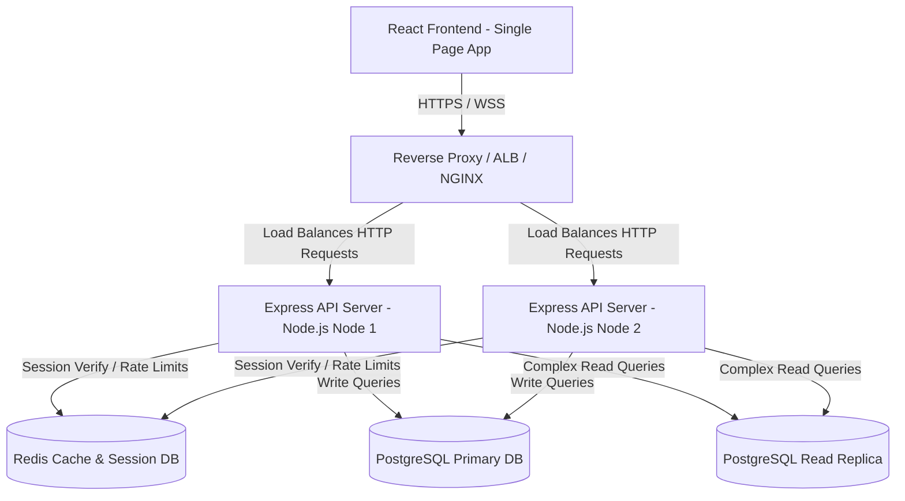

# System, Security & Deployment Architecture

This document defines the multi-tier system architecture, robust security policies, and containerized deployment workflow for the Healthcare Intelligence Platform (HIP).

---

## 1. System Architecture

The HIP uses a three-tier architecture designed for decoupling, security, and scalability. All application code is written in TypeScript on both the frontend and backend, enforcing type safety across system boundaries.



### 1.1 Front-End Client (UI Layer)
* **React.js & TypeScript:** Structured as a component-driven Single Page Application (SPA).
* **State Management:** 
  * **Global UI State:** React Context API (current user session, theme, active workspace).
  * **Server Cache State:** `React Query` (TanStack Query) for handling asynchronous API requests, data caching, auto-refreshes (polling for queue systems), and optimistic UI updates.
* **Styling:** Tailwind CSS with utility-first designs combined with strict clinical themes (high contrast, readable typography, dashboard component layout).
* **Communication:** Axios instance with interrupters to automatically attach JWT Bearer tokens and catch `401 Unauthorized` responses to trigger token refreshing.

### 1.2 Back-End Server (API Layer)
* **Node.js & Express.js:** Scalable RESTful API routing, modularized controller structure, and database abstractions.
* **Type-Safe DTOs:** Zod schema validation libraries validating incoming request query params and body shapes prior to controller execution.
* **Worker Process Abstraction:** CPU-intensive processes like generating PDF reports or excel files are processed asynchronously using a queue manager (e.g., BullMQ) backed by Redis, preserving main-thread loop responsiveness.

### 1.3 Database Layer (PostgreSQL)
* **Schema Integrity:** Strong schema design with primary/foreign key constraints, check constraints (e.g., triage status validations), and indexes.
* **Connection Pooling:** Utilizing `node-postgres` pooling (or PgBouncer in production) to handle high concurrency.
* **Separation of Concerns:** Reads are separated from writes in the repository layer, allowing easy transition to Read/Write database routing (using a Primary DB for inserts/updates and a Read Replica for dashboard reports).

---

## 2. Security Architecture

Medical data security is paramount. The platform is designed around data minimization, least-privilege, and robust auditing.

### 2.1 Authentication & Session Management
* **Stateless JWTs:** 
  * **Access Token:** Short-lived JWT (15-minute expiration) containing user UUID, email, and role, passed in the HTTP Authorization header.
  * **Refresh Token:** Long-lived UUID stored in a secure database table, passed to the client via an `HTTPOnly`, `Secure`, `SameSite=Strict` cookie (inaccessible to client-side scripts, protecting against XSS attacks).
* **MFA Architecture:** MFA-ready utilizing Time-Based One-Time Passwords (TOTP). Back-end generates a shared secret (`speakeasy` library) and displays it to the user as a QR code (`qrcode` library) during enrollment. Verification is required at every login if enabled.
* **Password Policy:** Enforced via backend validation:
  * Minimum 12 characters.
  * Must contain at least one uppercase letter, one lowercase letter, one digit, and one special character.
  * Checked against a list of compromised passwords.

### 2.2 Role-Based Access Control (RBAC)
Every endpoint is protected by a standard authorization middleware that checks the authenticated user's role against permissions:

```typescript
// Example Authorization Middleware
export const authorizeRoles = (...allowedRoles: string[]) => {
  return (req: Request, res: Response, next: NextFunction) => {
    const userRole = req.user?.role; // Extracted from verified JWT
    if (!allowedRoles.includes(userRole)) {
      return res.status(403).json({
        status: "error",
        message: "Forbidden: You do not have permission to access this resource"
      });
    }
    next();
  };
};
```

#### Role Permissions Matrix
| Module | Endpoint | Super Admin | Hosp Admin | Front Desk | ER Nurse | ER Doctor | Lab Tech | Lab Supervisor |
| :--- | :--- | :---: | :---: | :---: | :---: | :---: | :---: | :---: |
| **Auth** | User Registration | ✓ | ✓ | ✗ | ✗ | ✗ | ✗ | ✗ |
| **Front Desk** | Patient Register | ✗ | ✗ | ✓ | ✓ (Intake) | ✗ | ✗ | ✗ |
| **Front Desk** | Appointment Schedule | ✗ | ✗ | ✓ | ✗ | ✗ | ✗ | ✗ |
| **Emergency** | ER Intake / Triage | ✗ | ✗ | ✗ | ✓ | ✗ | ✗ | ✗ |
| **Emergency** | ER Consultation | ✗ | ✗ | ✗ | ✗ | ✓ | ✗ | ✗ |
| **Laboratory** | Sample Collection | ✗ | ✗ | ✗ | ✗ | ✗ | ✓ | ✗ |
| **Laboratory** | Result Validation | ✗ | ✗ | ✗ | ✗ | ✗ | ✗ | ✓ |
| **Analytics** | Export PDF/Excel | ✓ | ✓ | ✗ | ✗ | ✗ | ✗ | ✗ |

### 2.3 Data Encryption
* **In-Transit:** HTTPS forced globally. TLS 1.3 enforced, with fallbacks to TLS 1.2. HSTS (HTTP Strict Transport Security) enabled.
* **At-Rest (Sensitive Fields):** Patient Personal Identifiable Information (PII) such as CNIC and Passport numbers are encrypted inside the database columns using AES-256-GCM. Decryption keys are loaded into Node.js environment variables, ensuring that if database backups are leaked, raw CNIC/Passport details remain unreadable.

### 2.4 Audit Trails & Compliance
All actions modifying patient records, triage scores, or laboratory results are logged using an automated PostgreSQL database trigger, writing previous and new values to the `audit_logs` table:

```sql
CREATE OR REPLACE FUNCTION log_record_audit()
RETURNS TRIGGER AS $$
DECLARE
    current_user_id UUID;
BEGIN
    -- Extract active user ID from transaction settings (passed by server connection)
    current_user_id := NULLIF(current_setting('app.current_user_id', true), '')::UUID;
    
    INSERT INTO audit_logs (user_id, action, table_name, record_id, old_values, new_values)
    VALUES (
        current_user_id,
        TG_OP,
        TG_TABLE_NAME,
        COALESCE(NEW.id, OLD.id),
        CASE WHEN TG_OP IN ('UPDATE', 'DELETE') THEN row_to_json(OLD)::jsonb ELSE NULL END,
        CASE WHEN TG_OP IN ('INSERT', 'UPDATE') THEN row_to_json(NEW)::jsonb ELSE NULL END
    );
    RETURN NEW;
END;
$$ LANGUAGE plpgsql;
```

---

## 3. Deployment Architecture

Containerized infrastructure allows rapid scaling, environmental consistency, and straightforward cloud deployment.

### 3.1 Docker Compose Configuration

The following `docker-compose.yml` configures a complete local development/staging environment for Phase 1.

```yaml
version: '3.8'

services:
  # 1. Frontend Client
  frontend:
    build:
      context: ./frontend
      dockerfile: Dockerfile
    ports:
      - "80:80"
    depends_on:
      - backend
    networks:
      - hip-network
    restart: always

  # 2. Express Backend API
  backend:
    build:
      context: ./backend
      dockerfile: Dockerfile
    ports:
      - "5000:5000"
    environment:
      - PORT=5000
      - NODE_ENV=production
      - DATABASE_URL=postgresql://hip_user:hip_secure_pass@db:5432/hip_db
      - REDIS_URL=redis://redis:6379
      - JWT_SECRET=super_secret_jwt_sign_key_12345
      - ENCRYPTION_KEY=32_byte_hex_string_for_aes_gcm
    depends_on:
      - db
      - redis
    networks:
      - hip-network
    restart: always

  # 3. Redis (Cache, Sessions, & Queue)
  redis:
    image: redis:7.0-alpine
    ports:
      - "6379:6379"
    volumes:
      - redis_data:/data
    networks:
      - hip-network

  # 4. PostgreSQL Database
  db:
    image: postgres:15-alpine
    ports:
      - "5432:5432"
    environment:
      - POSTGRES_USER=hip_user
      - POSTGRES_PASSWORD=hip_secure_pass
      - POSTGRES_DB=hip_db
    volumes:
      - pg_data:/var/lib/postgresql/data
    networks:
      - hip-network
    restart: always

networks:
  hip-network:
    driver: bridge

volumes:
  pg_data:
  redis_data:
```

### 3.2 CI/CD Pipeline Blueprint (GitHub Actions)
```yaml
name: HIP CI/CD Pipeline

on:
  push:
    branches: [ main, develop ]
  pull_request:
    branches: [ main ]

jobs:
  test:
    runs-on: ubuntu-latest
    steps:
      - uses: actions/checkout@v3
      - name: Setup Node.js
        uses: actions/setup-node@v3
        with:
          node-version: 18
      - name: Install & Test Backend
        run: |
          cd backend
          npm ci
          npm run lint
          npm test
      - name: Install & Test Frontend
        run: |
          cd ../frontend
          npm ci
          npm run lint
          npm test

  build-and-push:
    needs: test
    if: github.ref == 'refs/heads/main'
    runs-on: ubuntu-latest
    steps:
      - uses: actions/checkout@v3
      - name: Configure AWS Credentials
        uses: aws-actions/configure-aws-credentials@v1
        with:
          aws-access-key-id: ${{ secrets.AWS_ACCESS_KEY_ID }}
          aws-secret-access-key: ${{ secrets.AWS_SECRET_ACCESS_KEY }}
          aws-region: us-east-1
      - name: Build and Push Docker Images
        run: |
          docker build -t hip-backend ./backend
          docker build -t hip-frontend ./frontend
          # Standard ECR push scripts...
```

### 3.3 Cloud Deployment Blueprint
* **Application Hosting:** AWS ECS Fargate hosting stateless containers (Frontend, Backend). Managed by an Application Load Balancer (ALB) directing traffic and terminating SSL.
* **Database Hosting:** AWS RDS PostgreSQL Multi-AZ deployment for high availability, automatic backups, and storage autoscaling.
* **Caching & PubSub:** AWS ElastiCache for Redis.
* **Content Delivery:** AWS CloudFront CDN caching frontend assets globally.
* **Secrets Management:** AWS Secrets Manager storing DB credentials and private JWT encryption keys.
