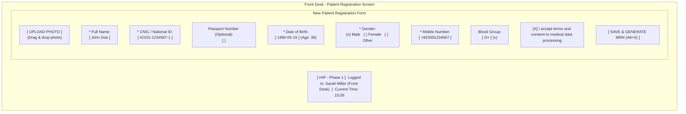
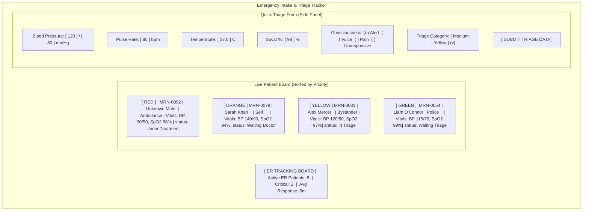
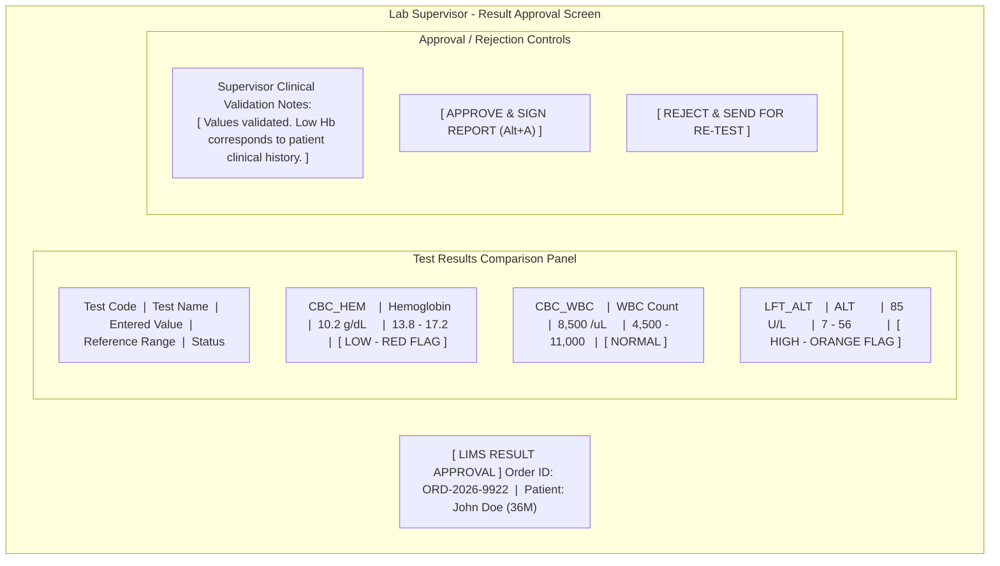
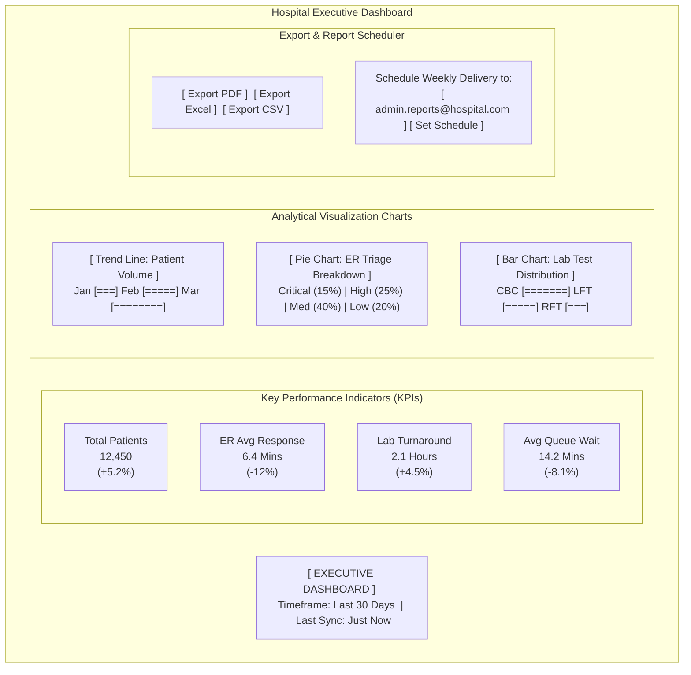

# Screen Designs & UI Wireframes

This document details the user interface structures, clinical usability considerations, style guides, and layout wireframes for key workflows in HIP.

---

## 1. UI/UX Style Guide & Color System

To achieve a premium, clinical, and high-trust experience, the Healthcare Intelligence Platform (HIP) uses a curated Dark Slate color system with vibrant, specialized accent colors to denote medical severity.

### 1.1 Color Palette (HSL & Hex Mapping)
*   **Primary Background (Slate Deep):** `#0F172A` (HSL 222, 47%, 11%) — Dominant background for the application canvas.
*   **Secondary Background (Slate Card):** `#1E293B` (HSL 217, 33%, 17%) — Background color for dashboards, metric cards, grids, and form containers.
*   **Primary Text (Off-White):** `#F8FAFC` (HSL 210, 40%, 98%) — Crisp, legible reading text.
*   **Secondary Text (Muted Slate):** `#94A3B8` (HSL 215, 20%, 65%) — Label names, details, and helper notes.
*   **Clinical Accents (Primary Action / Cyan):** `#06B6D4` (HSL 188, 86%, 53%) — Primary buttons, navigation highlights, active queue states.
*   **Information Accent (Indigo):** `#6366F1` (HSL 239, 84%, 67%) — Informational messages and scheduling status.

### 1.2 Severity & Triage Color Codes (Strict Clinical Standard)
*   **Critical (Red Alert):** `#EF4444` (HSL 0, 84%, 60%) — Active emergency resuscitation, extremely abnormal lab values.
*   **High (Orange Alert):** `#F97316` (HSL 20, 96%, 53%) — Emergent cases, out-of-range lab results.
*   **Medium (Yellow Alert):** `#EAB308` (HSL 45, 93%, 47%) — Urgent ER cases, validated warnings.
*   **Low (Green Normal):** `#10B981` (HSL 160, 84%, 39%) — Stable patients, standard waiting, normal lab levels.

### 1.3 Typography System
*   **Primary Typography:** `Outfit`, Sans-serif (Google Fonts) — clean, geometric, professional look.
*   **Body & Form Typography:** `Inter`, Sans-serif — high legibility, optimized for data-dense grids and forms.
*   **Scale:**
    *   **Main Dashboard Headers:** `24px` / `Font Weight: 700 (Bold)`
    *   **Subheaders / Section Headers:** `18px` / `Font Weight: 600 (Semibold)`
    *   **Body / Lab Metrics Input:** `14px` / `Font Weight: 400 (Regular)`
    *   **Data Labels:** `12px` / `Font Weight: 500 (Medium)`

---

## 2. Visual UI Mockups

Here are the visual representations showing the final polished layout, color system, and clinical dashboards.

### 2.1 Executive Dashboard Design Concept

### 2.2 Emergency Triage & Tracking Board Concept

---

## 3. UI/UX Clinical Design Guidelines
To minimize training and accelerate data entry for clinical and administrative staff, the frontend adheres to these core guidelines:
* **Keyboard Navigation:** Form layouts support complete keyboard operation (`Tab`, `Enter`, and hotkeys like `Alt+S` to save) to speed up front-desk and emergency registrations.
* **Responsive Layouts:** Sidebar navigation collapses on tablets and mobiles, expanding on 1080p desktop monitors to show split-screen patient cards.
* **Aggressive Data Caching:** Immediate visual loads of tables, grids, and patient cards using query invalidation patterns to prevent blank loading states.

---

## 4. UI Wireframes (Mermaid Mockups)

Below are the mock visual layouts representing the system's key operational screens.

### 2.1 Patient Registration Screen (Front Desk)
A split layout with dynamic validation state indicators and photo uploads.

### 2.2 Emergency Triage & Tracking Board (ER Nurse/Doctor)
A real-time tracking interface showing patients sorted by triage priority with color coding.

### 2.3 Laboratory Result Validation Screen (Lab Supervisor)
Displays test items, reference ranges, and critical flags before publication.

### 2.4 Executive Analytics Dashboard (Reporting Manager)
Displays operational analytics, patient volume trends, and service bottlenecks.

