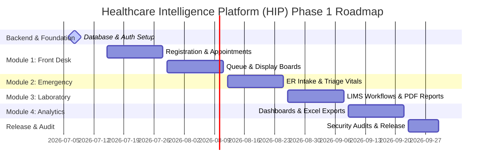

# Development Roadmap & Test Cases

This document details the project deployment schedule and test suite execution criteria for the Phase 1 implementation of HIP.

---

## 1. Development Roadmap

The development of Phase 1 is planned as a **12-week schedule** divided into six logical 2-week sprints. The architecture guarantees that future modules (Billing, Pharmacy, EMR) can integrate with the existing database and authentication schemas.

### 1.1 Milestone Details
1. **Milestone 1: Database & Auth Setup (Weeks 1-2)**
   - Initialize PostgreSQL schemas, audit triggers, and indexes.
   - Develop Auth REST endpoints (JWT creation, MFA TOTP generation, passport check middleware).
2. **Milestone 2: Front Desk Operations (Weeks 3-4)**
   - Develop patient search indexation and registration workflow.
   - Build appointment scheduling widgets and availability grids.
3. **Milestone 3: Queue Management & Display (Weeks 5-6)**
   - Deploy automated token generator services.
   - Create read-only real-time department and doctor queue boards using WebSockets.
4. **Milestone 4: Emergency Management (Weeks 7-8)**
   - Deploy rapid trauma entry controls.
   - Implement clinical triage forms (BP, heart rate, ESI scale calculator).
5. **Milestone 5: Laboratory LIMS Integration (Weeks 9-10)**
   - Build test panel configs, sample logging, and result entry forms.
   - Integrate PDF rendering service (Puppeteer/PDFKit) for official report creation.
6. **Milestone 6: Analytics, Security Audits & Handover (Weeks 11-12)**
   - Build operational dashboard KPI aggregators and data exporters.
   - Conduct penetration testing, role-access audits, and execute containerized cloud deployment.

---

## 2. System Test Cases

To verify that the implementation conforms to both functional specifications and HIPAA requirements, the following test cases must pass prior to system release.

### 2.1 Front Desk Operations (Patient Registration & Scheduling)

#### TC-FD-01: Patient Registration Form Validation
* **Description:** Verify that registering a patient with missing mandatory fields fails, and successful submission returns a valid MRN.
* **Pre-conditions:** Front Desk Officer is logged in.
* **Execution Steps:**
  1. Navigate to the patient registration page.
  2. Leave "Full Name" blank. Enter other valid fields. Click "Save".
  3. Verify that the UI displays a validation message and rejects the submission.
  4. Complete the form with Name: "Jane Watson", DOB: "1988-11-20", CNIC: "42101-9876543-2", and check "Consent Accepted".
  5. Click "Save".
* **Expected Result:**
  * Steps 2-3 fail to submit; database is unchanged.
  * Step 5 successfully creates the record.
  * The system displays a success toast and returns a unique MRN (e.g., `MRN-2026-00001`).

#### TC-FD-02: Queue Token Routing
* **Description:** Check that checking in a registered patient places them in the selected doctor's queue.
* **Pre-conditions:** Patient is registered. General Medicine department and Dr. Sarah Smith exist in the system.
* **Execution Steps:**
  1. Open the patient's record.
  2. Click "Check-In".
  3. Select Department "General Medicine", Doctor "Dr. Sarah Smith".
  4. Click "Check-in to Queue".
* **Expected Result:**
  * Patient status changes to "Checked-in".
  * A unique queue token is generated (e.g., `GM-DRSARAH-04`).
  * The Doctor's active patient list shows the token in position 4.
  * The waiting list monitor display board renders the token in real time.

---

### 2.2 Emergency Management (Triage & Workload Escalation)

#### TC-ER-01: Rapid Trauma Intake
* **Description:** Verify that an emergency patient can be registered with minimal details for rapid processing.
* **Pre-conditions:** Emergency Reception Officer is logged in.
* **Execution Steps:**
  1. Open the Emergency Intake screen.
  2. Type "Unknown Female 01" in the name field.
  3. Select Mode of Arrival: "Ambulance", Ambulance Service: "Red Crescent".
  4. Input Initial Condition: "Unconscious, head injury".
  5. Click "Submit Intake".
* **Expected Result:**
  * The profile is saved.
  * System generates a unique intake ID and records the arrival timestamp.
  * The patient appears on the Nurse's active triage queue with the status "Waiting for Triage".

#### TC-ER-02: Triage Priority Sorting & Escalation
* **Description:** Verify that recording critical vitals marks the patient as high priority and places them at the top of the doctor's queue.
* **Pre-conditions:** Patient "Unknown Female 01" is registered in emergency.
* **Execution Steps:**
  1. Log in as an Emergency Nurse.
  2. Select "Unknown Female 01" from the triage list.
  3. Input vitals: BP: "90/50", Pulse: "120", SpO2: "89%", consciousness: "Pain".
  4. Select Triage Category "Critical". Click "Save Triage".
* **Expected Result:**
  * The vitals record is linked to the intake file.
  * The status updates to "Triage Completed (Waiting for Doctor)".
  * The patient appears at the top of the Emergency Doctor's active patient queue (critical first).

---

### 2.3 Laboratory Information Management System (LIMS)

#### TC-LB-01: Laboratory Result Verification Flow
* **Description:** Ensure that raw results logged by a technician must be verified by a supervisor before release.
* **Pre-conditions:** A test order is placed. The sample is collected and marked "In Laboratory".
* **Execution Steps:**
  1. Log in as a Lab Technician.
  2. Select the sample and input values: Hemoglobin: "11.2", WBC: "6,000". Click "Submit".
  3. Log in as the Patient, check the Patient Portal, and verify if the PDF report is accessible.
  4. Log in as the Lab Supervisor. Navigate to the validation page, review the values, and click "Approve and Sign".
  5. Re-check the Patient Portal as the patient.
* **Expected Result:**
  * Step 2 saves results with status "Pending Validation".
  * Step 3: No report is displayed to the patient.
  * Step 4: The status transitions to "Completed" and the PDF is digitally signed.
  * Step 5: The patient can view and download the official PDF report.

---

### 2.4 Security & Compliance

#### TC-SEC-01: RBAC Endpoint Guarding
* **Description:** Verify that users cannot access API routes that are outside of their role permissions.
* **Pre-conditions:** Standard Lab Technician token is generated.
* **Execution Steps:**
  1. Issue a POST request to `/api/v1/auth/users` (Admin user creation endpoint) using the Lab Technician's JWT token.
  2. Verify the HTTP response code and payload message.
* **Expected Result:**
  * The request returns an HTTP `403 Forbidden` response.
  * The JSON response contains the error message: "Forbidden: You do not have permission to access this resource".
  * The unauthorized attempt is logged in the `audit_logs` table.
